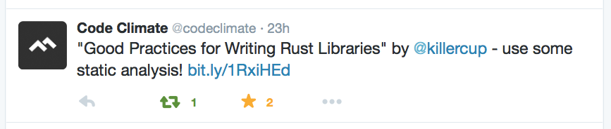
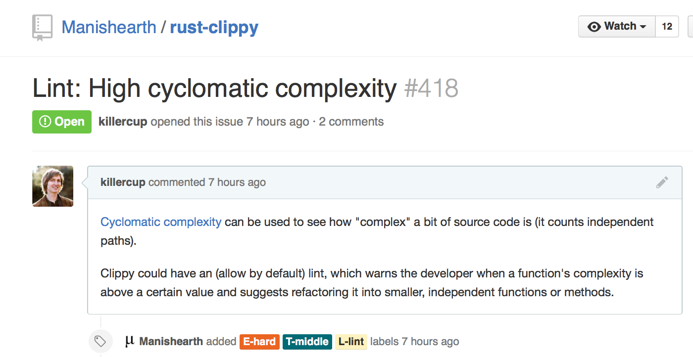

## Lints, Lints Everywhere

---

Lints are basically compiler warning plugins

---

`rustc` already has a few, some disabled by default

`rustc -W help` shows a list

<aside class="notes">

```plain
missing_docs,
missing_debug_implementations, missing_copy_implementations,
trivial_casts, trivial_numeric_casts,
unsafe_code,
unstable_features,
unused_import_braces, unused_qualifications
```

</aside>

---

### My favorite lint

"missing docs": detects missing documentation for public members

`#![deny(missing_docs)]` makes every crate better

---

### Clippy

Crate that contains additional lints, e.g. `approx_constant` or `needless_return`

Get it from [github.com/Manishearth/rust-clippy](https://github.com/Manishearth/rust-clippy)

<aside class="notes">

- "the approximate of a known float constant (in `std::f64::consts` or `std::f32::consts`) is found; suggests to use the constant"
- If only Andre (@llogiq) was here to talk about it!

</aside>

---

I wrote an article about this last weekend. Then this happend:



<aside class="notes">

- CodeClimate does static analysis for Ruby, JavaScript, PHP, Python
- Rates your modules based on complexity and code style

</aside>

---



---

